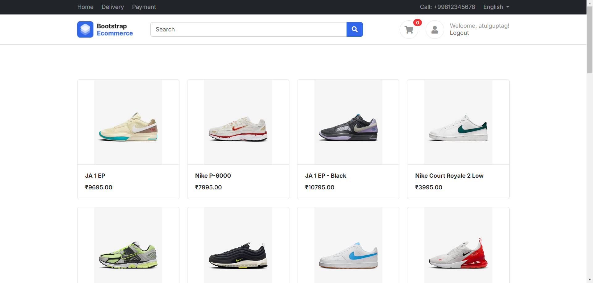
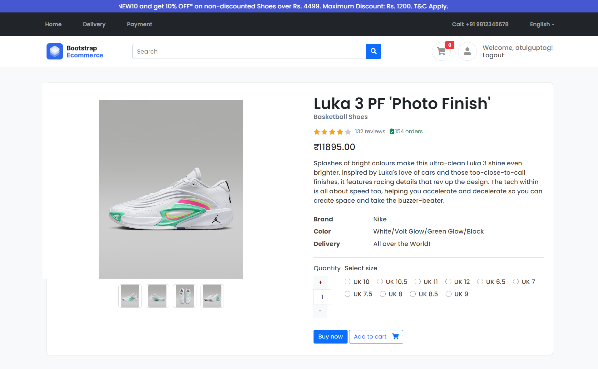
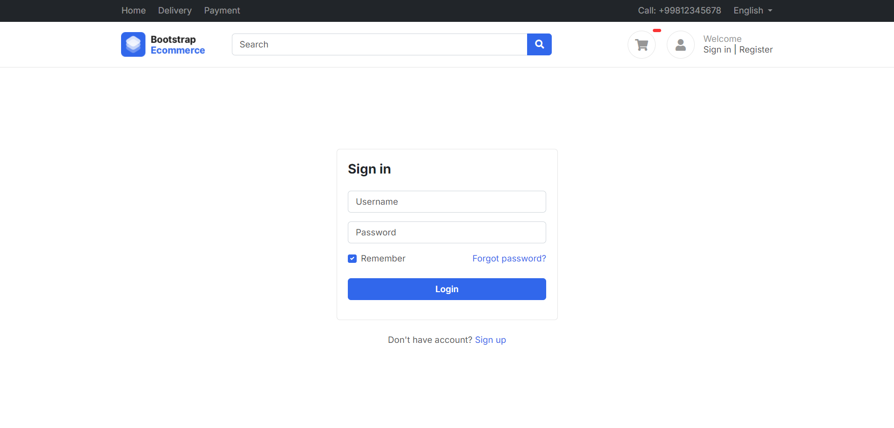
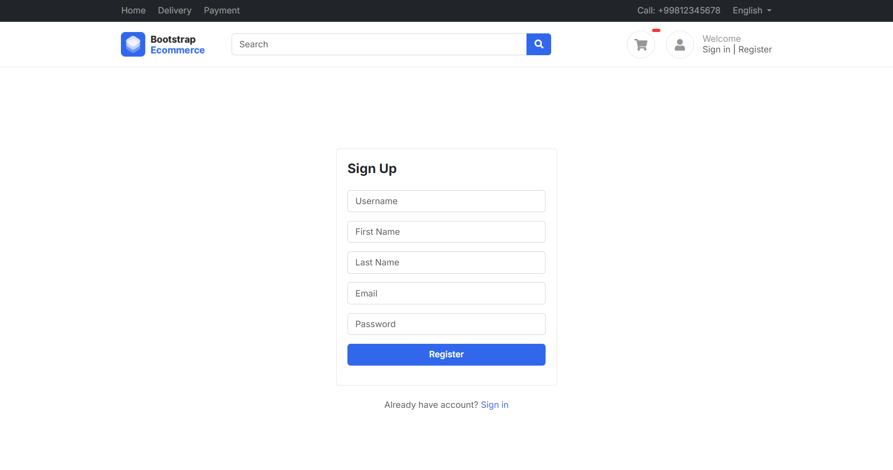

# Django eCommerce Website

This project is a full-fledged eCommerce website built using Django, a high-level Python web framework. It includes essential features such as user authentication, product browsing, cart management, checkout process, payment integration, and more. The website is designed to be robust, scalable, and user-friendly, providing a seamless shopping experience for customers.

## Table of Contents
- [Features](#features)
- [Technologies Used](#technologies-used)
- [Setup Instructions](#setup-instructions)
- [Usage](#usage)
- [Contributing](#contributing)
- [License](#license)

## Features
- **User Authentication:** Secure user registration, login, and profile management.
- **Product Catalog:** Browse and search products with detailed descriptions and images.
- **Shopping Cart:** Add, update, and remove items from the cart seamlessly.
- **Checkout Process:** Smooth checkout flow with order summary and address management.
- **Payment Integration:** Integrated with Razorpay for secure online payments.
- **Order Management:** View order history and status updates.
- **Responsive Design:** Mobile-friendly UI ensuring a consistent experience across devices.
- **Admin Panel:** Manage products, orders, and users efficiently through Django's admin interface.

## Screenshots

### Homepage


### Product Page


### Cart Page


### Login Page


### Register Page


## Project Demo Video
[](https://www.youtube.com/watch?v=PywuBtSJrp8)


## Technologies Used
- **Django:** Python-based web framework for backend development.
- **HTML/CSS/JavaScript:** Frontend development for a responsive and interactive UI.
- **Razorpay API:** Payment gateway integration for secure transactions.
- **Bootstrap:** Frontend framework for responsive design and UI components.

## Setup Instructions
To run this project locally, follow these steps:

1. **Clone the repository:**
   ```bash
   https://github.com/atulguptag/Django-eCommerce-Website.git
   cd Django-eCommerce-Website
   ```

2. **Create a virtual environment:**
   ```bash
   python -m venv venv
   ```
   
3. **Activate the virtual environment:**
   - On Windows:
     ```bash
     .\venv\Scripts\activate
     ```
   - On macOS/Linux:
     ```bash
     source venv/bin/activate
     ```

4. **Install dependencies:**
   ```bash
   pip install -r requirements.txt
   ```

5. **Apply database migrations:**
   ```bash
   python manage.py migrate
   ```

6. **Create a superuser (admin):**
   ```bash
   python manage.py createsuperuser
   ```

7. **Start the development server:**
   ```bash
   python manage.py runserver
   ```

8. **Open your web browser and navigate to:**
   ```
   http://127.0.0.1:8000/
   ```

## Usage
- **Admin Panel:** Access the admin panel at `http://127.0.0.1:8000/admin/` to manage products, orders, and users.
- **Shopping:** Browse products, add items to the cart, proceed to checkout, and make payments using Razorpay.
- **Profile:** Users can register, login, view their order history, and update their profiles.

## Contributing
Contributions are welcome! Please fork this repository and create a pull request with your proposed features, enhancements, or bug fixes.

## License
This project is licensed under the [MIT License](LICENSE).

